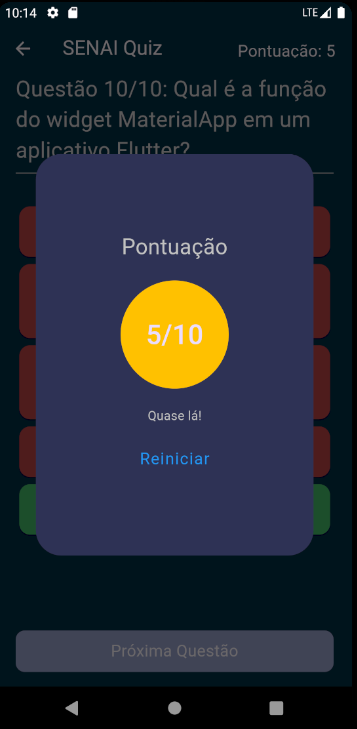
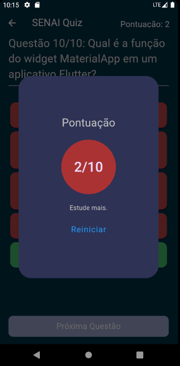

# Quiz Flutter App 🚀

Um aplicativo simples de Quiz desenvolvido em Flutter para testar seus conhecimentos!

## Screenshots 📱

### Tela Inicial


### Tela de Questões


### Tela de Resultados




## Como Jogar 🎮

1. Abra o aplicativo.
2. Insira seu nome na tela inicial.
3. Clique no botão para iniciar o Quiz.
4. Responda às perguntas e veja seu resultado no final!

## Funcionalidades 🚀

- Página inicial para inserir o nome do jogador.
- Perguntas de Quiz com opções de resposta.
- Página de resultado exibindo a pontuação final.

## Tecnologias Utilizadas 💻

- Flutter
- Dart

## Como Executar o Projeto 🛠️

1. Clone o repositório:

   ```bash
   git clone https://github.com/seu-usuario/nome-do-repositorio.git
   
2.  Navegue até o diretório do projeto:

```bash
  cd nome-do-repositorio
```
3. Execute o aplicativo:

```bash
  flutter run
```

Licença 📄
Este projeto é licenciado sob a Licença MIT.

Feito com ❤️ por Ruan Cláudio Damasceno Souza
