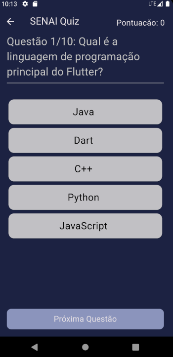

# Quiz Flutter App 🚀

A simple Quiz app developed in Flutter to test your knowledge!

## Note: Screens are initially in Portuguese (pt-br).
## Screenshots 📱

### Welcome Screen


### Quiz Screen


### Results Screen


## How to Play🎮

1. Open the app.
2. Enter your name on the welcome screen.
3. Click the button to start the Quiz.
4. Answer the questions and see your final score!

## Features 🚀

- Welcome screen to enter the player's name.
- Quiz questions with answer options.
- Results page displaying the final score.

## Technologies Used 💻

- Flutter
- Dart

## How to Run the Project 🛠️

1. Clone the repository:

   ```bash
   git clone https://github.com/seu-usuario/nome-do-repositorio.git
   
2. Navigate to the project directory:

   ```bash
   cd nome-do-repositorio

3. Run the app:

   ```bash
   flutter run

## License 📄
This project is licensed under the MIT License.

Made with ❤️ by Ruan Cláudio Damasceno Souza
